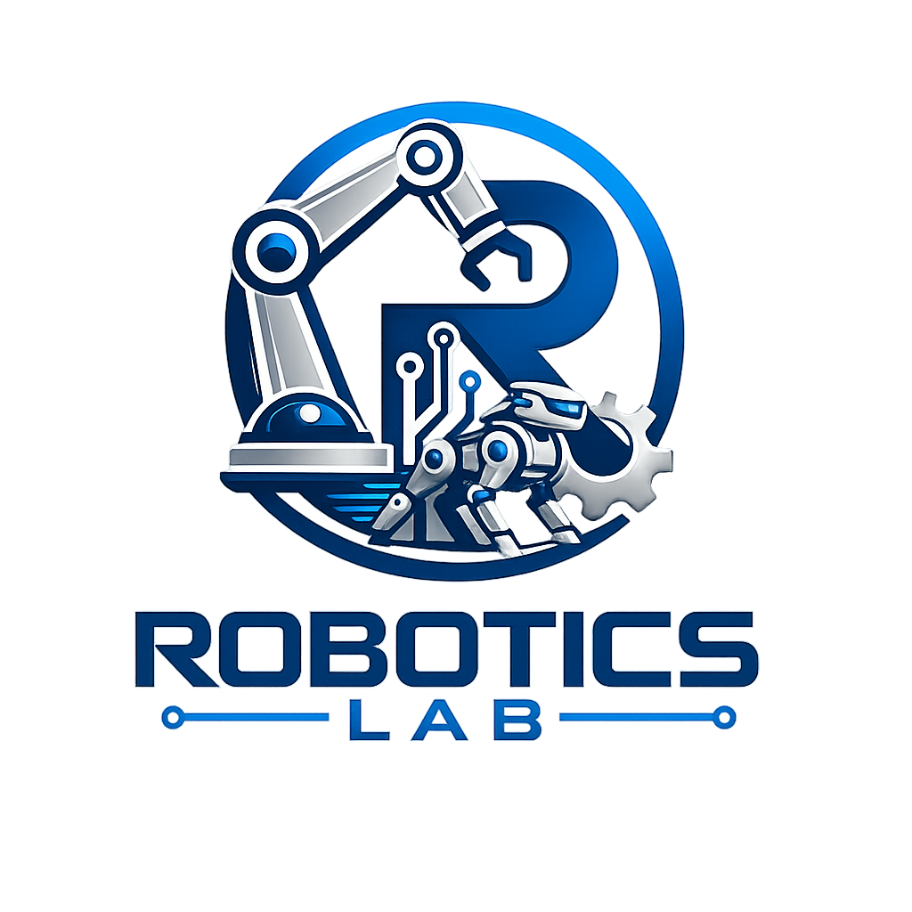

# Robotics Lab

<p align="center">
  
</p>

Robotics Lab is an experimental, open-source robotics framework. Its purpose is
to explore robot control, communication, hardware abstraction, simulation, and
developer tooling without depending on ROS or another robotics framework.

The project is intentionally small at the beginning. Interfaces will be added
only when an experiment demonstrates a concrete need for them.

## Repository layout

```text
.
├── .agents/    AI-agent context, skills, and working conventions
├── cmake/      Reusable CMake modules and toolchain files
├── dev/        Reproducible development environment and helper scripts
├── docs/       Architecture, decisions, and user/developer guides
└── modules/    Framework modules (C++, Python, or mixed-language)
```

Modules are organized by capability rather than programming language. A module
may expose a C++ API, a Python API, or bindings between the two while keeping
its implementation, tests, and documentation together.

## Quick start

On a machine with CMake 3.24+, Ninja, a C++20 compiler, and the MuJoCo 3.11+
native SDK:

```bash
cmake --preset dev
cmake --build --preset dev
ctest --preset dev
```

Alternatively, use the container configuration in [`dev/`](dev/README.md).

## Current status

The repository contains the initial project skeleton and a minimal `core`
library used to verify the build and test pipeline. The first framework APIs
will be driven by the first robot experiment.

## Acknowledgment

This repository was created and is being developed with the assistance of AI
agents.

## License

Licensed under the [Apache License 2.0](LICENSE).
